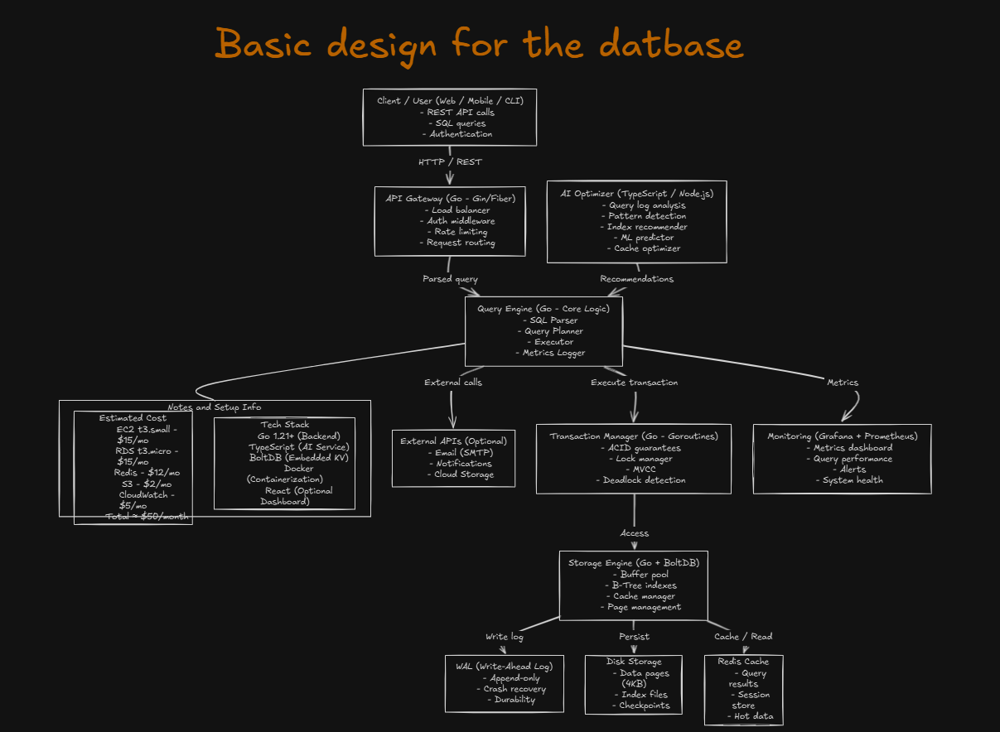

# 🚀 StartDB

<div align="center">


[](https://golang.org)
[](https://www.typescriptlang.org)
[](LICENSE)

**An AI-Powered Adaptive Database Management System**

_Self-optimizing • Cloud-Native • Built from Scratch_

</div>

---

## 🧠 Overview

StartDB is a next-generation experimental database engine that learns from usage patterns and optimizes itself automatically. Unlike traditional databases that require manual tuning, StartDB uses AI to predict query patterns, manage indexes, and adapt to workload changes in real-time.

**Think of it as a database with a built-in DBA that works 24/7.**

### Why StartDB?

Modern applications generate dynamic workloads with constantly changing access patterns. Traditional databases require:

- ⏰ Manual index creation and maintenance
- 🔧 Human intervention for optimization
- 📊 Periodic performance analysis

StartDB automates this entire workflow through intelligent pattern recognition and predictive optimization.

---

## 🏛️ Architecture

<div align="center">



_StartDB's layered architecture with AI-powered optimization_

</div>

---

## ✨ Key Features

### 🏗️ Core Database Engine (Go)

- **Custom Storage Engine**: Built-from-scratch persistence layer with disk and in-memory support
- **ACID Transactions**: Write-Ahead Logging (WAL) ensures data durability and crash recovery
- **Concurrent Operations**: Goroutine-based architecture for high-throughput parallel queries
- **Flexible Indexing**: B-Tree and hash-based indexes with dynamic creation/deletion
- **SQL-Like Query Language**: Familiar syntax with custom parser implementation

### 🤖 AI Optimization Layer (TypeScript)

- **Query Pattern Analysis**: Machine learning models identify frequent and slow queries
- **Predictive Indexing**: Automatically recommends and creates indexes based on access patterns
- **Adaptive Caching**: Dynamic cache policies that evolve with workload changes
- **Performance Prediction**: Forecasts query execution time and resource usage
- **Schema Recommendations**: Suggests data model optimizations based on usage

### ☁️ Cloud-Native Design

- **Containerized Architecture**: Docker-first design for consistent deployment
- **Orchestration Ready**: Kubernetes manifests for auto-scaling and high availability
- **Observability**: Built-in metrics export for Prometheus/Grafana monitoring
- **Distributed Ready**: Foundation for multi-node clusters (future phase)

### 🚀 Aerospike-Inspired Performance

- **Hybrid Memory Architecture**: Combines RAM speed with SSD persistence for optimal performance
- **Automatic Sharding**: Intelligent data distribution across nodes for load balancing
- **Multi-Tiered Storage**: Flexible storage options (in-memory, hybrid-flash, all-flash)
- **Smart Client**: Automatic cluster awareness and traffic distribution
- **Real-time Notifications**: Event streaming for data changes and system events

---

## 🗺️ Roadmap

### Phase 1: Foundation ✅

- [x] In-memory key-value store
- [x] Basic CRUD operations
- [x] CLI interface

### Phase 2: Persistence ✅

- [x] Disk-based storage
- [ ] Write-Ahead Logging
- [ ] Crash recovery
- [ ] Concurrent transactions

### Phase 3: Query Engine 📅

- [ ] SQL parser
- [ ] B-Tree indexing
- [ ] Query planner
- [ ] Join operations

### Phase 4: AI Integration 📅

- [ ] Query log analyzer
- [ ] Pattern recognition
- [ ] Index recommender
- [ ] Predictive caching

### Phase 5: Cloud & Scale 📅

- [ ] Kubernetes deployment
- [ ] Horizontal scaling
- [ ] Distributed transactions
- [ ] Multi-region support

### Phase 6: Aerospike-Inspired Features 📅

- [ ] **Hybrid Memory Architecture**: RAM + SSD optimization for speed and storage efficiency
- [ ] **Automatic Sharding**: Smart data distribution across nodes with load balancing
- [ ] **Multi-Tiered Storage**: In-memory, hybrid-flash, and all-flash storage options
- [ ] **Smart Client**: Automatic traffic distribution and cluster awareness
- [ ] **Dynamic Cluster Management**: Auto-rebalancing and node management
- [ ] **Change Notifications**: Real-time event streaming for data changes
- [ ] **Lossless Compression**: Efficient storage with compression algorithms

---

## 🚀 Getting Started

### Prerequisites

- **Go** 1.21 or higher

### Quick Start

#### 1. Clone the Repository

```bash
git clone https://github.com/Bhup-GitHUB/startdb.git
cd startdb
```

#### 2. Build and Run

```bash
go build -o bin/startdb ./cmd/startdb
./bin/startdb
```

#### 3. Basic Usage

**Memory Storage (Default):**

```bash
startdb set user:1 "John Doe"
startdb get user:1
startdb list
```

**Disk Storage (Persistent):**

```bash
startdb --storage=disk set user:1 "John Doe"
startdb --storage=disk get user:1
startdb --storage=disk list
```

**Custom Data File:**

```bash
startdb --storage=disk --data=my_database.json set key:1 "Custom file"
startdb --storage=disk --data=my_database.json get key:1
```

### Available Commands

- `set <key> <value>` - Store a key-value pair
- `get <key>` - Retrieve a value by key
- `delete <key>` - Remove a key-value pair
- `exists <key>` - Check if a key exists
- `list` - List all keys in the database
- `version` - Show version information

### Storage Options

- `--storage=memory` - In-memory storage (default, temporary)
- `--storage=disk` - Disk storage (persistent)
- `--data=filename.json` - Custom data file path

---

## 📖 Documentation

- **[Usage Guide](docs/USAGE.md)** - Complete guide on how to use StartDB
- **[Quick Reference](docs/QUICK_REFERENCE.md)** - Quick command reference
- **[Architecture](ARCHITECTURE.md)** - Technical architecture and design decisions

---

## 🤝 Contributing

Contributions are welcome! This is a learning project, so:

- 🐛 Bug reports and fixes
- 💡 Feature suggestions
- 📖 Documentation improvements
- 🧪 Test coverage

---

## 📜 License

MIT License © 2025 Bhupesh Kumar
F

---

## 👨‍💻 Author

**Bhupesh Kumar**

Backend Developer | Cloud Enthusiast | Systems Programmer

- 💼 [LinkedIn](https://www.linkedin.com/in/bhupesh-k-185327366)
- 🐙 [GitHub](https://github.com/Bhup-GitHUB)

---

<div align="center">

**If you find this project interesting, consider giving it a ⭐!**

Made with Go, TypeScript, and countless cups of coffee ☕
